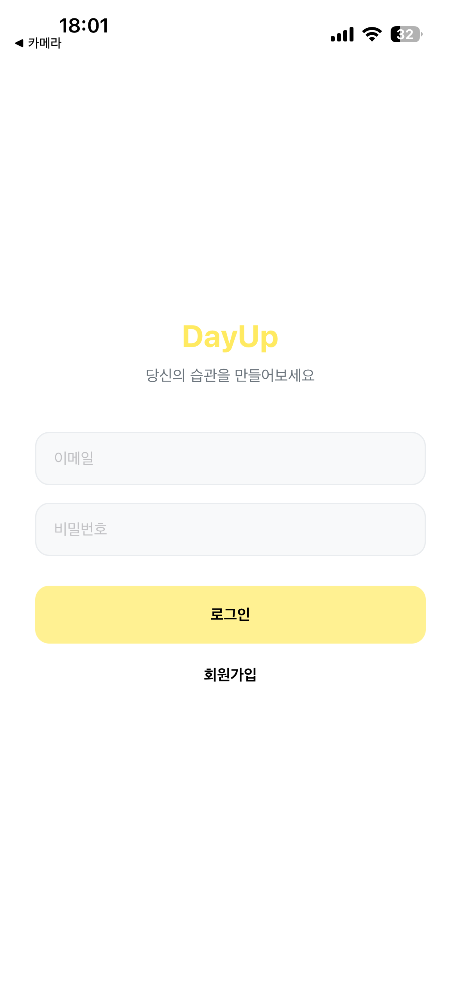
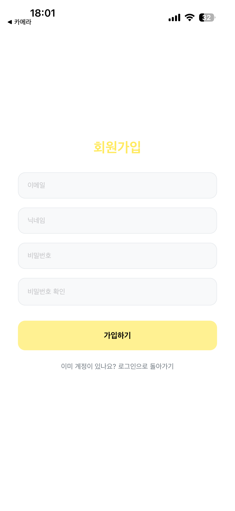
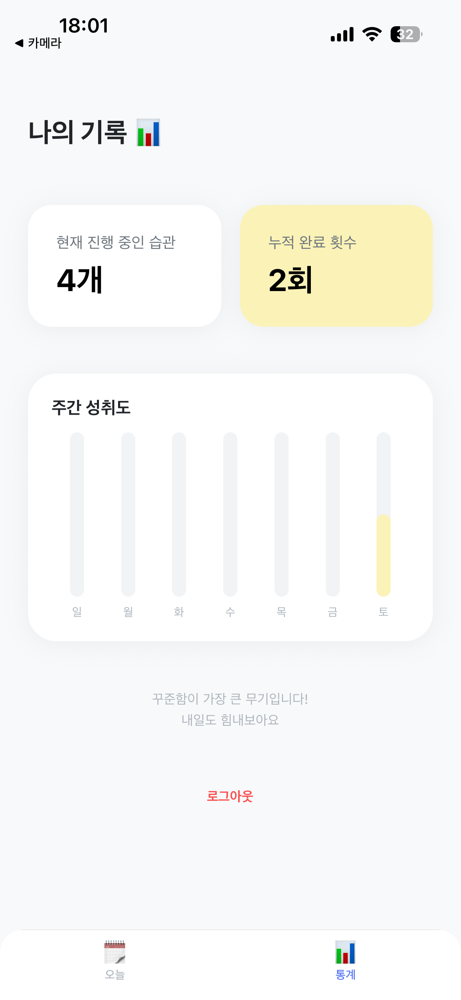

# DayUp - 나만의 습관 관리 앱

> **"매일 조금씩 더 나은 나를 만듭니다."** > Firebase 기반의 실시간 습관 추적 및 관리 서비스입니다.

## ✨ 주요 기능
- **로그인 및 회원가입**: 이메일 인증을 통한 사용자별 독립적인 데이터 관리.
- **실시간 데이터 동기화**: Firebase Firestore를 연동하여 기기를 바꿔도 유지되는 습관 리스트.
- **개인화 대시보드**: 가입 시 설정한 닉네임과 함께 오늘의 날짜, 성취도를 한눈에 확인.
- **성취도 시스템**: 습관 완료 시 실시간으로 채워지는 프로그레스 바.

## 🛠 Tech Stack
- **Frontend**: React Native, Expo, TypeScript
- **State Management**: Zustand
- **Backend**: Firebase (Authentication, Firestore)
- **Navigation**: React Navigation (Stack, Bottom Tabs)

## 📸 Screenshots

